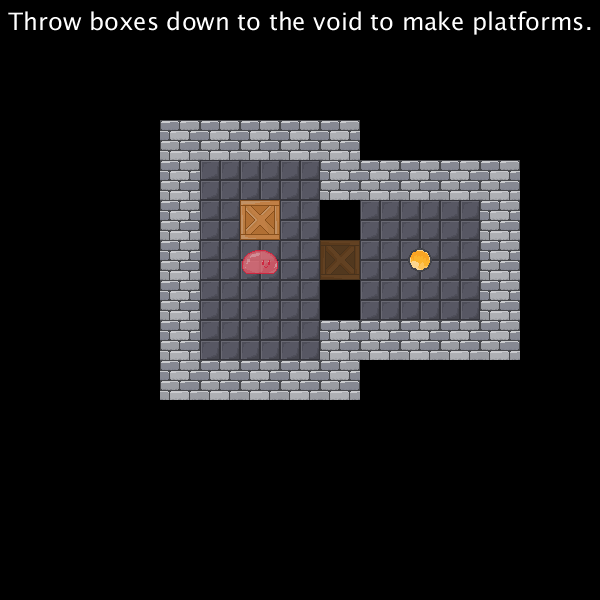
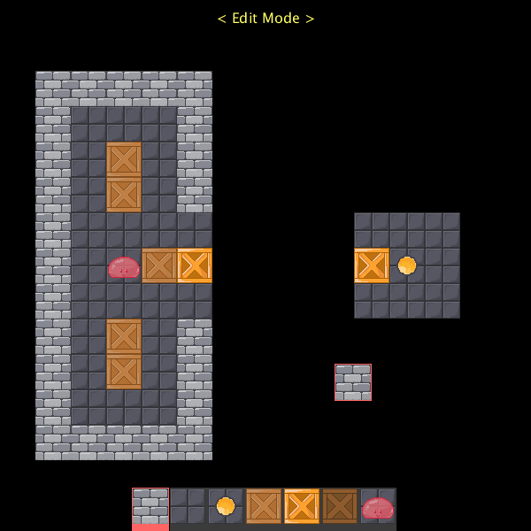

# Sokoban

A classic Sokoban puzzle game built in [Processing 3](https://processing.org/) as a first-year university project.

The player's goal is to push every crate onto its marked spot. Uniquely, in this version, crates can be shoved into the void to create platforms the player can walk across.

The game has 30 hand-crafted levels of increasing difficulty, a level select menu with progress tracking, and a fully functional in-game level editor.

## Screenshots

*Crates pushed into the void become walkable platforms*

*In-game level editor*

## How to Run

1. Download and install [Processing 3](https://processing.org/download).
2. Open `Sokoban.pde` in Processing.
3. Press the Run button (or `Ctrl+R`).

## Controls

### Game

- Arrow keys - Move
- `R` - Restart level
- `N` - Next level
- `B` - Previous level
- `L` - Open level select
- `E` - Open level editor
- `Enter` - Continue to next level (after completing one)
- `]` - Reset all progress

### Level Editor

- `1` through `7` - Select tile from toolbar
- `S` - Save level to `map0.txt`
- `R` - Clear the canvas
- `E` - Exit editor (save first!)
- `H` - Toggle toolbar visibility
- `Left click` - Place selected tile
- `Right click` - Erase tile

## Game Objects

- `0` - Void
- `O` - Floor
- `1` - Wall
- `B` - Crate
- `V` - Crate on spot (placed correctly)
- `X` - Crate spot
- `D` - Crate in void (acts as a platform)
- `@` - Player

## Level Format

Levels are plain text files (`map1.txt` through `map30.txt`) stored in the `data/` folder. Each file is a 15x15 grid of the symbols above. `map0.txt` is reserved for the level editor's output.

## Credits

Development: Tomasz Raby  
Textures: Nymphaeale

Built with [Processing 3](https://processing.org).
